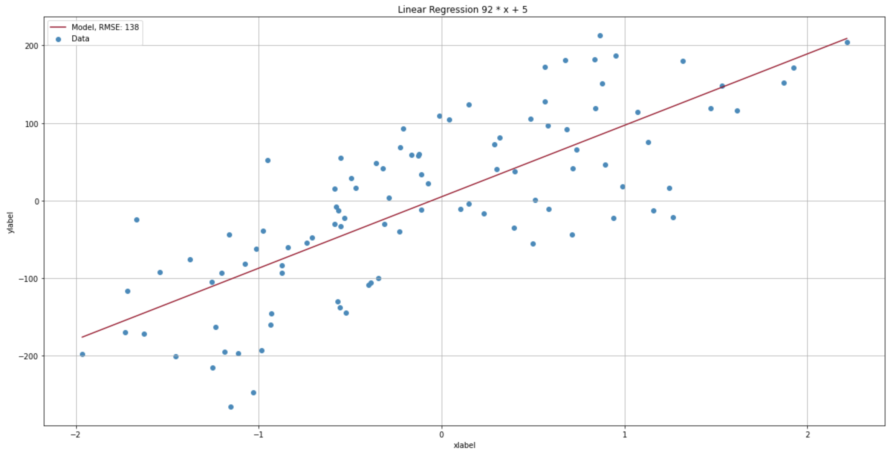

# VRNK - ML with Numpy only

## Linear Regression

```python
from sklearn.datasets import make_regression
from linear_regression import LinearRegression

X, y = make_regression(n_features=1, noise=65)

lreg = LinearRegression()
lreg.fit(X, y)

lreg.coef_
# output: [92, 5]

lreg.predict([-1, 24])
# output: [-87, 2213]

lreg.plot()

# Need Confidence interval

```



